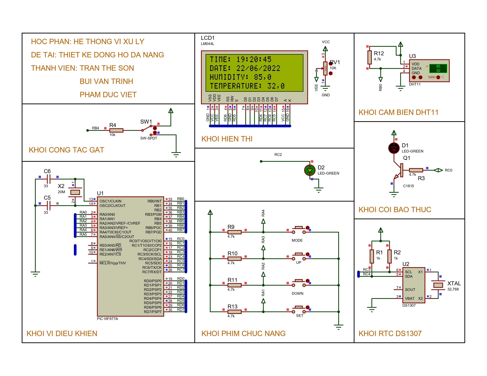

# Clock LCD

## Đồng Hồ Đa Năng Sử Dụng PIC16F877A

## Chức năng

- Hiển thị thời gian thực: giờ, phút, giây, ngày, tháng, năm trên màn hình hiển thị LCD 20x4
- Đọc nhiệt độ, độ ẩm từ cảm biến DHT11 và hiển thị lên LCD 20x4
- Cài đặt, điều khiển thời gian, ngày giờ theo ý muốn của người dùng
- Cài đặt báo thức (ở đây dùng đèn để hiển thị báo thức)
- Chế độ bấm giờ trong đồng hồ
- Đèn nhấp nháy theo giây (PWM)

## Đối tượng nghiên cứu

- Vi điều khiển PIC 16F877A
- Màn hình LCD 2004
- Mạch thời gian thực RTC DS1307
- Cảm biến nhiệt độ, độ ẩm DHT11
